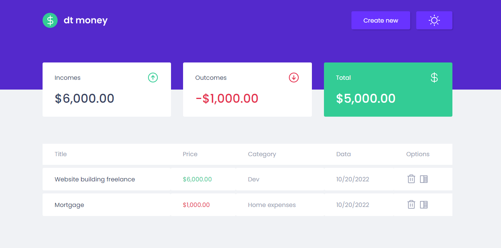

# DT MONEY




> Project developed in the Rocketseat ignite course.

DT Money is a project designed to help you manage your money, where you can register every income and outcome that comes to you. Then is lists all of your expenses and puts everything into a summary.

### Fixed and upgrades

This project is fully developed and properly working but it could have some changes:

- [x] Responsivity down to 330px
- [x] Theme switcher that stores to localstorage
- [x] Update and delete registers
- [ ] Better mobile layout
- [ ] Fully developed back-end (currently using MirageJS)

## 💻 Prerequisites

Before going on, make sure you have the most recent versions of the following packages:

- NodeJS
- NPM

## 🚀 Installing <DT_MONEY>

To use it just run:

Linux, macOS and Windows:

```
git clone https://github.com/lamongabriel/rocketseat-ignite-dt-money.git
cd /rocketseat-ignite-dt-money/
npm install
npm start
```

## ☕ Usage <DT_MONEY>

```
Click on create new button and after you fill every field,you need to select if this transaction is an income or an outcome.
Then you can add this transaction to the list. You can edit or delete every single transaction.
The summary on top helps you better manage your finances.
```

## 💡 Technologies

This project was developed using severous technologies to help organize, maintain and develop it.

- ReactJS
- TypeScript
- Styled Components
- Radix UI
- Axios
- Polished
- MirageJS
- HTML, CSS and JS
